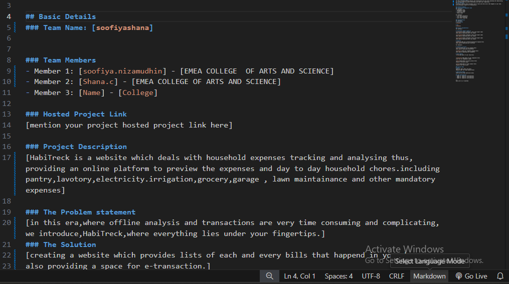
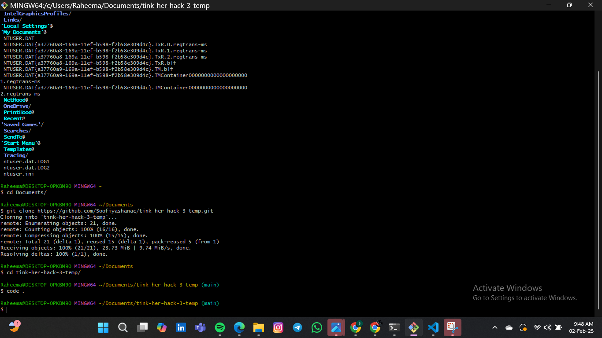

# [HabiTreck] 🎯

## Basic Details
### Team Name: [soofiyashana]

### Team Members
- Member 1: [soofiya.nizamudhin] - [EMEA COLLEGE  OF ARTS AND SCIENCE]
- Member 2: [Shana.c] - [EMEA COLLEGE OF ARTS AND SCIENCE]

### Hosted Project Link
[mention your project hosted project link here]

### Project Description
[HabiTreck is a website which deals with household expenses tracking and analysing thus,providing an online platform to preview the expenses and day to day household chores.including pantry,lavotory,electricity.irrigation,grocery,garage , lawn maintainance and other mandatory expenses]

### The Problem statement
[in this era,where offline analysis and transactions are very time consuming and complicating,we introduce,HabiTreck,where everything lies under your fingertips.]
### The Solution
[creating a website which provides lists of each and every bills that happend in your home.
also providing a space for e-transaction.]

## Technical Details
### Technologies/Components Used
For software:
-chatGpt
-

### Implementation
For Software:html

# Run
[open index.html in any latest browser]

### Project Documentation
For Software:
HTML,CSS,

 *shows developing in github*

 *shows developing in readme.md*

*developing in github*

## Team Contributions
- [shana.c]: [html webpage creating]
- [soofiya.N]:[IMAGE COLLECTING AND CREATING ]

Made with ❤️ at TinkerHub
